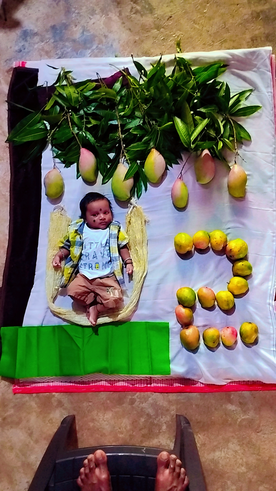

<!DOCTYPE html>
<html lang="en">
<head>
  <meta charset="UTF-8">
  <title>Happy Birthday Tangii!</title>
  
</head>
<body>

  <h1>🎉 Happy Birthday, Talkative Tangii! 🎂</h1>

  

    You're a bundle of joy, laughter, and never-ending chatter — and we wouldn't have it any other way! 
    Keep spreading your sunshine wherever you go.  
    Here’s a little surprise made just for you... with love and mangoes! 🍋💛
  

  

    
  

  

    <h2>🎵 Your Birthday Song</h2>
    <iframe 
      src="https://www.youtube.com/embed/hjqrHteZ3G4" 
      title="Birthday Song"
      allowfullscreen>
    </iframe>
  

</body>
</html>
